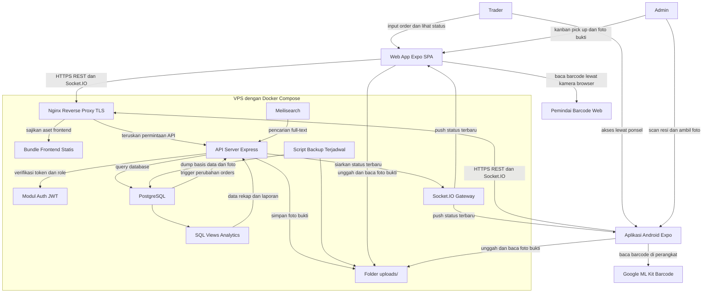
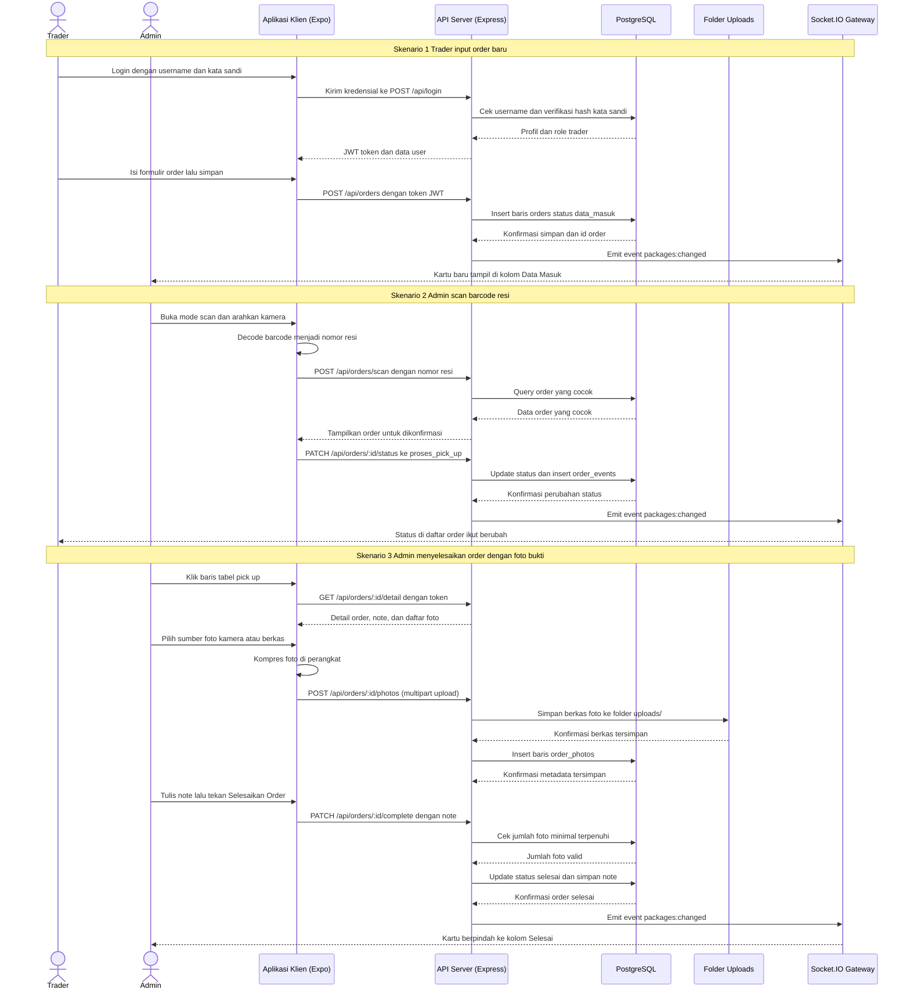
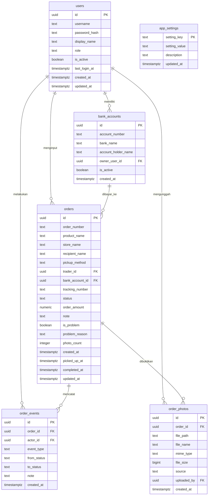

# PRD: Project Requirements Document

## 1. Overview

**TraderTrack** adalah aplikasi web dan aplikasi Android internal untuk tim trader dan admin yang melakukan pembelian barang di marketplace lalu mengambil barangnya secara fisik. Penggunanya hanya dua kelompok: trader yang melakukan checkout dan mencatat pesanan, serta admin yang mengeksekusi pengambilan barang dan memantau seluruh proses sampai selesai.

Saat ini pencatatan hasil checkout tersebar di catatan pribadi dan grup chat. Akibatnya admin tidak tahu pasti barang mana yang sudah datang, siapa trader yang melakukan checkout, ke rekening mana pembayaran harus direkap, dan order mana yang sudah tertunda terlalu lama. Ketika paket menumpuk di titik pick up, admin harus mencocokkan nomor resi ke nomor pesanan secara manual, dan itu lambat serta rawan salah orang. Tidak ada bukti visual bahwa barang benar-benar sudah diterima, dan tidak ada satu pun sumber data tunggal yang bisa dipercaya untuk rekap harian.

Tujuan utama aplikasi ini adalah menyatukan seluruh siklus order ke dalam satu papan kerja: trader menginput data checkout, admin memindai barcode resi untuk menandai barang sudah di-pick up, lalu menutup order lewat modal detail dengan catatan dan foto bukti yang wajib diunggah. Semua perubahan status tampil realtime di papan Kanban admin dan di daftar order trader, dan seluruh data terkumpul menjadi laporan jumlah order per trader, rekap pembayaran per rekening, serta daftar order tertunda atau bermasalah. Target skala jelas dan kecil: di bawah 20 pengguna aktif dengan 50 sampai 200 order per hari, sehingga seluruh sistem sengaja dirancang ramping dan dijalankan mandiri memakai Docker di satu VPS milik perusahaan.

## 2. Requirements

- **Platform Utama:** Aplikasi web responsif yang dioptimalkan untuk desktop dan tablet, dipakai untuk input order, tabel pick up, papan Kanban, dan analytics. Dibangun dari basis kode yang sama dengan aplikasi Android.
- **Platform Mobile:** Aplikasi Android berbentuk berkas APK yang dibangun dari basis kode frontend yang sama (Expo React Native), dengan akses kamera untuk scan barcode resi dan pengambilan foto bukti penyelesaian.
- **Autentikasi Wajib:** Tidak ada halaman yang bisa diakses tanpa login. Akun dibuat oleh admin, tidak ada registrasi mandiri. Sesi memakai JWT access token dengan masa berlaku terbatas yang disimpan di database.
- **Model Role:** Hanya dua role, yaitu trader dan admin. Trader dapat melihat seluruh inputan order dan hanya boleh mengubah order miliknya selama status masih Data Masuk. Admin memiliki akses penuh termasuk papan Kanban, scan pick up, penyelesaian order, master rekening, dan analytics.
- **Konektivitas:** Aplikasi membutuhkan koneksi internet aktif. Perubahan status disiarkan realtime lewat Socket.IO dari server API ke semua klien yang sedang membuka aplikasi tanpa perlu refresh manual.
- **Bukti Foto Penyelesaian:** Order tidak boleh berpindah ke status Selesai sebelum admin mengunggah minimal satu foto bukti. Foto dapat diambil langsung dari kamera perangkat atau dipilih dari berkas dan galeri, dikompresi di perangkat sebelum diunggah, lalu disimpan di folder uploads di VPS yang sama.
- **Model Bisnis:** Aplikasi internal perusahaan, gratis untuk semua pengguna, tanpa pembayaran, tanpa langganan, dan tanpa iklan. Biaya operasional hanya berupa satu VPS dan nama domain.
- **Skala Data:** Dirancang untuk di bawah 20 pengguna aktif dan 50 sampai 200 order per hari, atau sekitar 4.000 sampai 6.000 baris order per bulan, ditambah sekitar 1 sampai 3 foto per order. PostgreSQL dan penyimpanan berkas lokal sangat memadai untuk skala ini sampai beberapa tahun ke depan.
- **Batasan Cakupan:** Tidak ada integrasi API ke marketplace mana pun. Semua data order diinput manual oleh trader. Tidak ada modul stok, tidak ada modul pengiriman ke pelanggan akhir, tidak ada proses pembayaran di dalam aplikasi. Rekap pembayaran hanya bersifat pencatatan dan pelaporan.
- **Integrasi Luar:** Pemindai barcode berbasis kamera perangkat, memakai Google ML Kit Barcode Scanning di Android dan pemindai kamera berbasis browser di web. Tidak ada integrasi pihak ketiga lain dan tidak ada layanan cloud berbayar.
- **Infrastruktur Mandiri:** Seluruh backend dijalankan sendiri memakai Docker Compose di satu VPS, terdiri dari reverse proxy Nginx, server API Express, PostgreSQL, Meilisearch untuk pencarian, dan penyimpanan berkas lokal untuk foto. Port database dan Meilisearch tidak dibuka ke internet, hanya dapat diakses lewat jaringan internal Docker.
- **Keamanan Data:** Otorisasi ditegakkan di lapisan server API dengan pemeriksaan role dan kepemilikan data pada setiap endpoint, bukan hanya disembunyikan di antarmuka. Kata sandi disimpan dalam bentuk hash bcrypt. Seluruh lalu lintas memakai HTTPS lewat Nginx + Certbot, dan foto bukti hanya bisa diakses lewat URL yang diverifikasi JWT.
- **Cadangan Data:** Backup basis data harian otomatis memakai dump terjadwal beserta salinan berkas foto, dengan retensi minimal 14 hari dan satu salinan di luar VPS.
- **Analytics:** Laporan minimal wajib mencakup jumlah order per trader, rekap pembayaran per rekening, dan daftar order tertunda atau bermasalah, dengan filter rentang tanggal.
- **Bahasa dan Gaya Antarmuka:** Seluruh label berbahasa Indonesia, tampilan padat informasi, kontras tinggi, tabel dan angka menjadi elemen utama.
- **Deployment:** Frontend dibangun menjadi aset statis via `npx expo export -p web` dan disajikan oleh Nginx reverse proxy pada VPS yang sama dengan API, sedangkan APK didistribusikan langsung ke perangkat tim atau lewat EAS Build. Seluruh koneksi ke database melewati server API, tidak ada akses langsung dari klien.

## 3. Core Features

1. **Autentikasi dan Manajemen Role**
   - Login memakai username dan kata sandi ke endpoint server API, sesi dipertahankan lewat JWT access token yang diverifikasi di setiap request.
   - Setiap akun memiliki tepat satu role, yaitu trader atau admin, yang menentukan menu dan hak aksesnya.
   - Admin dapat membuat akun baru, mengubah nama lengkap, mengganti role, mereset kata sandi, dan menonaktifkan akun tanpa menghapus riwayat ordernya.
   - Akun nonaktif ditolak saat login, dan akun tersebut tidak muncul di dropdown pemilihan trader.
   - Data yang disimpan: profil, role, dan hash kata sandi di tabel `users`.
   - Aturan: pengguna tidak bisa mengubah role dirinya sendiri, dan akun terakhir dengan role admin tidak boleh dinonaktifkan.

2. **Input Order oleh Trader**
   - Formulir input berisi nama produk, nama toko, nomor pesanan, nama penerima sesuai alamat kirim, metode pengambilan, nama trader, dan nomor rekening.
   - Metode pengambilan berupa dropdown dengan dua pilihan tetap: Zaydan Ambilan GJM dan Self Pick Up.
   - Nama trader terisi otomatis dari akun yang sedang login dan dapat diganti oleh admin bila menginput atas nama orang lain.
   - Nomor rekening dipilih dari daftar rekening terdaftar, dengan opsi menambah rekening baru langsung dari formulir.
   - Nomor pesanan bersifat unik. Jika nomor sudah pernah diinput, sistem menolak simpan dan menampilkan order yang sudah ada.
   - Kolom nominal order bersifat opsional dan dipakai hanya untuk menghitung total rekap per rekening.
   - Order baru selalu tersimpan dengan status Data Masuk dan otomatis mencatat waktu input serta pembuatnya.
   - Data yang disimpan: tabel `orders`, referensi ke `users` dan `bank_accounts`, jejak pembuatan di `order_events`.

3. **Daftar Order Lengkap untuk Trader**
   - Tabel padat berisi seluruh order dari semua trader, bukan hanya milik sendiri, sesuai kebutuhan transparansi tim.
   - Kolom tabel: nomor pesanan, nama produk, nama toko, nama penerima, metode pengambilan, nama trader, nomor rekening, status, penanda foto bukti, dan waktu input.
   - Pencarian cepat berdasarkan nomor pesanan, nama produk, nama penerima, atau nomor resi.
   - Filter berdasarkan status, metode pengambilan, trader, dan rentang tanggal, dengan penomoran halaman sisi server.
   - Trader hanya boleh mengedit atau menghapus order miliknya sendiri selama status masih Data Masuk. Setelah itu baris menjadi baca saja.
   - Trader dapat membuka pratinjau foto bukti pada order yang sudah selesai, tanpa hak mengubah atau menghapus foto tersebut.
   - Baris berubah warna dan status ikut berubah realtime saat admin melakukan pick up atau menyelesaikan order.

4. **Pick Up dengan Scan Barcode Resi**
   - Halaman khusus admin berisi tabel order berstatus Data Masuk yang menunggu pengambilan.
   - Tombol scan membuka kamera perangkat dan membaca barcode atau QR pada label resi, memakai pemindai native di Android dan pemindai berbasis browser di web.
   - Hasil pemindaian dikirim ke server API untuk dicocokkan ke nomor resi atau nomor pesanan pada data order yang ada.
   - Jika cocok, status order berubah menjadi Proses Pick Up, nomor resi tersimpan, dan waktu pick up dicatat.
   - Jika tidak cocok, aplikasi menampilkan peringatan dan menawarkan pencarian manual serta penempelan nomor resi ke order terpilih.
   - Jika order sudah pernah dipindai, aplikasi memberi tahu bahwa barang tersebut sudah diproses beserta waktu dan nama admin yang memindai.
   - Mode pindai berturut-turut tersedia agar admin dapat memindai banyak paket tanpa menutup kamera.
   - Data yang disimpan: kolom `tracking_number`, `status`, `picked_up_at` di `orders`, dan satu baris di `order_events` per pemindaian.

5. **Modal Detail dan Penyelesaian Order dengan Foto Bukti**
   - Klik pada baris tabel pick up membuka modal detail berisi nomor pesanan, nama produk, nama penerima, nama trader yang melakukan checkout, kolom note, dan kolom foto bukti.
   - Modal juga menampilkan nama toko, metode pengambilan, nomor rekening, dan nomor resi sebagai konteks tambahan.
   - Kolom foto bukti berbentuk kotak unggah bertanda plus. Saat diklik muncul pop up pilihan sumber foto: Ambil dari Kamera atau Pilih dari Berkas.
   - Pilihan Ambil dari Kamera membuka kamera native di aplikasi Android dan kamera perangkat lewat browser di web, sedangkan Pilih dari Berkas membuka galeri atau penjelajah berkas.
   - Foto dikompresi otomatis di perangkat sebelum diunggah, lalu ditampilkan sebagai thumbnail dengan tombol hapus dan tombol pratinjau ukuran penuh.
   - Admin dapat mengunggah beberapa foto sesuai batas jumlah dan ukuran yang diatur di pengaturan, dengan indikator progres unggah per berkas.
   - Tombol Selesaikan Order nonaktif sampai jumlah minimal foto terunggah, dan server menolak permintaan penyelesaian yang tidak memenuhi syarat foto meskipun dikirim langsung ke API.
   - Admin mengisi note lalu menekan tombol Selesaikan Order untuk memindahkan status ke Selesai dan mencatat waktu penyelesaian.
   - Admin dapat menandai order sebagai bermasalah beserta alasannya tanpa harus menyelesaikannya, dan boleh melampirkan foto sebagai bukti kendala.
   - Modal memuat riwayat singkat perubahan status beserta pelakunya, waktunya, dan jumlah foto yang diunggah.
   - Aturan: hanya admin yang boleh menyelesaikan order dan mengunggah atau menghapus foto bukti. Order berstatus Selesai tidak bisa diubah kembali kecuali oleh admin lewat aksi buka kembali yang tercatat di riwayat.
   - Data yang disimpan: kolom `note`, `status`, `completed_at`, `is_problem`, `problem_reason` di `orders`, metadata berkas di `order_photos`, berkas fisik di folder uploads, dan riwayat di `order_events`.

6. **Papan Kanban Admin Realtime**
   - Tiga kolom tetap sesuai alur kerja: Data Masuk, Proses Pick Up, dan Selesai.
   - Setiap kartu menampilkan nomor pesanan, nama produk, nama penerima, nama trader, dan lama order berada di kolom tersebut.
   - Kartu dapat digeser antar kolom untuk mengubah status. Perpindahan ke kolom Selesai membuka modal detail agar admin melengkapi note dan foto bukti terlebih dahulu.
   - Klik kartu membuka modal detail yang sama dengan pada tabel pick up.
   - Kartu baru muncul dan berpindah secara otomatis di layar semua admin tanpa refresh, memakai Socket.IO dari server API.
   - Kolom Selesai secara bawaan hanya menampilkan order hari berjalan agar papan tetap ringan, dengan filter rentang tanggal bila perlu.
   - Kartu yang melewati batas waktu tertunda diberi penanda visual kontras tinggi.

7. **Dashboard Analytics dan Rekap**
   - Kartu ringkasan di bagian atas: total order, order Data Masuk, order Proses Pick Up, order Selesai, dan order bermasalah pada rentang tanggal terpilih.
   - Laporan jumlah order per trader, diurutkan menurun, lengkap dengan jumlah order selesai dan yang belum selesai.
   - Rekap pembayaran per rekening berisi nomor rekening, nama bank, nama pemilik, jumlah order, dan total nominal bila kolom nominal diisi.
   - Daftar order tertunda atau bermasalah berisi order yang melewati ambang waktu tertunda atau yang ditandai bermasalah, diurutkan dari yang paling lama.
   - Filter rentang tanggal cepat: hari ini, tujuh hari terakhir, bulan berjalan, dan rentang khusus.
   - Ekspor hasil laporan ke berkas CSV untuk rekap manual di luar aplikasi.
   - Sumber data laporan adalah tampilan SQL agregat di atas tabel `orders`, `users`, dan `bank_accounts`, dibaca lewat endpoint laporan di server API.

8. **Master Rekening dan Pengaturan**
   - Admin mengelola daftar rekening yang boleh dipilih trader: nomor rekening, nama bank, dan nama pemilik rekening.
   - Rekening dapat dinonaktifkan sehingga tidak muncul di dropdown, tanpa memutus keterkaitan dengan order lama.
   - Pengaturan ambang waktu tertunda dalam satuan jam, dipakai oleh papan Kanban dan laporan order tertunda.
   - Pengaturan foto bukti: jumlah minimal foto untuk menyelesaikan order, jumlah maksimal foto per order, dan ukuran maksimal per berkas.
   - Aturan: rekening yang sudah pernah dipakai order tidak boleh dihapus permanen, hanya boleh dinonaktifkan, dan jumlah minimal foto tidak boleh disetel nol.
   - Data yang disimpan: tabel `bank_accounts` dan tabel `app_settings`.

## 4. User Flow

1. **Masuk ke Aplikasi:** Pengguna membuka aplikasi web atau aplikasi Android, memasukkan username dan kata sandi, lalu server API memverifikasi hash kata sandi dan mengembalikan token JWT beserta role pengguna.
2. **Pengalihan Berdasarkan Role:** Trader diarahkan ke halaman Daftar Order beserta tombol input order baru. Admin diarahkan ke papan Kanban sebagai halaman utama.
3. **Trader Menginput Order:** Trader membuka formulir, mengisi nama produk, nama toko, nomor pesanan, nama penerima, memilih metode pengambilan Zaydan Ambilan GJM atau Self Pick Up, memastikan nama trader benar, lalu memilih nomor rekening.
4. **Order Tersimpan dan Tersiar:** Server menolak nomor pesanan ganda, menyimpan order dengan status Data Masuk, lalu menyiarkan event lewat Socket.IO sehingga kartu baru langsung muncul di kolom Data Masuk pada layar admin.
5. **Admin Memindai Resi:** Saat paket tiba, admin membuka halaman Pick Up, menekan tombol scan, dan mengarahkan kamera ke barcode resi.
6. **Sistem Mencocokkan Barang:** Hasil pemindaian dicocokkan ke nomor resi atau nomor pesanan. Bila cocok, status berubah menjadi Proses Pick Up dan waktu pick up tercatat. Bila tidak cocok, admin mencari manual lalu menempelkan nomor resi ke order yang benar.
7. **Admin Membuka Modal Detail:** Admin mengklik baris di tabel pick up atau kartu di papan Kanban, lalu melihat nomor pesanan, nama produk, nama penerima, nama trader yang checkout, kolom note, dan kolom foto bukti.
8. **Admin Mengunggah Foto Bukti:** Admin menekan kotak foto, memilih Ambil dari Kamera atau Pilih dari Berkas pada pop up, mengambil atau memilih foto, lalu aplikasi mengompresi dan mengunggahnya ke folder uploads di server dan menampilkan thumbnail hasil unggahan.
9. **Admin Menyelesaikan Order:** Setelah jumlah minimal foto terpenuhi, admin menulis note dan menekan Selesaikan Order, lalu status berpindah ke Selesai. Bila ada kendala, admin menandai order sebagai bermasalah beserta alasannya.
10. **Trader Memantau Status:** Perubahan status langsung terlihat di Daftar Order milik semua trader tanpa refresh, dan trader dapat membuka pratinjau foto bukti untuk memastikan barang sudah diambil atau sudah selesai.
11. **Rekap dan Evaluasi:** Admin membuka dashboard analytics, memilih rentang tanggal, membaca jumlah order per trader, rekap pembayaran per rekening, dan daftar order tertunda, lalu mengekspor CSV bila diperlukan.
12. **Pemeliharaan Master Data:** Admin menambah atau menonaktifkan rekening, membuat akun pengguna baru, serta menyetel ambang waktu tertunda dan aturan foto bukti sesuai kebutuhan operasional.

## 5. Architecture

Arsitekturnya tetap sederhana namun sepenuhnya mandiri: satu aplikasi klien berbasis React Native (Expo) yang dikompilasi menjadi dua target, yaitu aset statis untuk web via `npx expo export -p web` dan berkas APK untuk Android melalui EAS Build. Seluruh backend berjalan di satu VPS yang diorkestrasi Docker Compose, terdiri dari reverse proxy Nginx yang mengurus TLS dan penyajian aset statis, server API Express yang menyediakan REST dan kanal Socket.IO, PostgreSQL sebagai satu-satunya sumber kebenaran data, Meilisearch untuk pencarian full-text, dan folder uploads lokal untuk foto bukti. Klien tidak pernah menyentuh database secara langsung: semua otorisasi dan validasi ditegakkan di server API berdasarkan role dan kepemilikan data, termasuk syarat wajib foto sebelum order boleh diselesaikan. Pembaruan realtime dikirim dari server API ke klien lewat Socket.IO setiap kali baris order berubah, sehingga papan Kanban dan tabel order selalu sinkron. Foto bukti diunggah langsung dari perangkat ke server API dan disimpan di folder uploads, dengan autentikasi JWT pada endpoint `/uploads/` sehingga hanya pengguna terautentikasi yang bisa melihat foto. Laporan analytics dihitung memakai tampilan SQL agregat di dalam database, bukan diproses ulang di klien. Pemindaian barcode berjalan sepenuhnya di perangkat memakai Google ML Kit Barcode Scanning lewat plugin Expo di Android dan pemindai kamera berbasis browser di web, sehingga tidak ada gambar pemindaian yang dikirim ke server. APK didistribusikan langsung ke perangkat tim tanpa toko aplikasi atau lewat EAS Build.

## 6. Sequence Diagram

Diagram berikut menggambarkan tiga alur inti yang paling menentukan produk: trader menginput order baru sampai muncul realtime di papan admin, admin memindai barcode resi untuk memindahkan order ke Proses Pick Up, dan admin menutup order lewat modal detail dengan foto bukti wajib. Aktor dan komponen yang terlibat adalah Trader, Admin, Aplikasi Klien, API Server, PostgreSQL, Uploads Storage, dan Socket.IO Gateway.

## 7. Database Schema

Skema ini memakai PostgreSQL 16 yang berjalan di container Docker pada VPS, dengan tujuh tabel utama. Tabel `users` menyimpan profil, role, dan hash kata sandi bcrypt sekaligus, karena tidak ada lagi layanan autentikasi eksternal. Tabel `orders` adalah inti sistem dan menampung seluruh field formulir trader, nomor resi hasil scan, status Kanban, note penyelesaian, serta penanda bermasalah. Tabel `order_photos` menyimpan metadata foto bukti penyelesaian berupa path berkas lokal, ukuran, tipe berkas, dan pengunggahnya, sementara berkas fisiknya disimpan di folder uploads di VPS. Tabel `order_events` mencatat setiap perubahan status sebagai jejak audit yang dipakai di riwayat modal detail. Di atas tabel tersebut dibuat tampilan SQL baca saja untuk analytics, yaitu `v_order_per_trader`, `v_rekap_rekening`, dan `v_order_tertunda`. Nilai status yang dipakai konsisten di seluruh aplikasi: `data_masuk`, `proses_pick_up`, dan `selesai`, sedangkan nilai metode pengambilan adalah `zaydan_ambilan_gjm` dan `self_pick_up`. Seluruh perubahan skema dikelola lewat berkas migrasi SQL (`schema.sql`) yang dijalankan saat container API dinyalakan.

- **users**: `id`, `username`, `password_hash`, `display_name`, `role`, `is_active`, `last_login_at`, `created_at`, `updated_at`
- **orders**: `id`, `order_number`, `product_name`, `store_name`, `recipient_name`, `pickup_method`, `trader_id`, `bank_account_id`, `tracking_number`, `status`, `order_amount`, `note`, `is_problem`, `problem_reason`, `photo_count`, `created_at`, `picked_up_at`, `completed_at`, `updated_at`
- **order_photos**: `id`, `order_id`, `file_path`, `file_name`, `mime_type`, `file_size`, `source`, `uploaded_by`, `created_at`
- **order_events**: `id`, `order_id`, `actor_id`, `event_type`, `from_status`, `to_status`, `note`, `created_at`
- **bank_accounts**: `id`, `account_number`, `bank_name`, `account_holder_name`, `owner_user_id`, `is_active`, `created_at`
- **app_settings**: `setting_key`, `setting_value`, `description`, `updated_at`

## 8. Tech Stack

Pemilihan teknologi didasarkan pada tiga hal: biaya operasional serendah mungkin dengan seluruh backend berjalan mandiri di satu VPS, kecepatan membangun MVP oleh developer level menengah, dan kebutuhan satu basis kode yang bisa menghasilkan aplikasi web sekaligus berkas APK. Karena backend terkelola tidak dipakai, autentikasi, realtime, dan penyimpanan berkas dibangun sebagai komponen internal di dalam Docker Compose, dengan pilihan pustaka yang matang agar tetap ringkas. Arsitektur ini mengikuti pola yang sudah terbukti di project PickHub: Express + PostgreSQL + Socket.IO + Nginx, dengan Expo sebagai framework frontend lintas platform.

### Frontend & Mobile

- **Framework:** React Native dengan Expo SDK 57. Menghasilkan satu basis kode yang bisa dibangun menjadi aset statis web (`npx expo export -p web`) dan berkas APK (`eas build -p android --profile preview`), sehingga tidak perlu menulis ulang antarmuka untuk platform berbeda.
- **Platform Web:** Expo Metro bundler menghasilkan bundle JavaScript yang disajikan langsung oleh Nginx sebagai aset statis. Tidak memerlukan server rendering atau Vite.
- **Platform Android:** EAS Build atau Android Studio menghasilkan APK dari basis kode yang sama. Expo menangani bridge ke kamera, galeri, dan notifikasi secara native tanpa perlu Capacitor.
- **Styling:** React Native StyleSheet dengan tema kontras tinggi dan warna kustom via constants. Tabel dan angka menjadi elemen utama dengan tipografi yang mudah dibaca cepat.
- **State & Data Fetching:** Custom hooks (`usePackages`, `useOrders`) dengan fetch biasa dan optimis update. Cache dikelola di state komponen dengan fetch ulang parsial saat ada event Socket.IO.
- **Pencarian:** Meilisearch diaktifkan via API server untuk pencarian full-text di kolom nama produk, penerima, nomor pesanan, dan nomor resi.

### Backend

- **Server API:** Express.js (Node.js) berjalan sebagai container Docker. Menyediakan REST endpoints, validasi input, penegakan role dan syarat foto bukti, serta mengelola koneksi Socket.IO untuk pembaruan realtime.
- **Autentikasi:** Implementasi sendiri di API server memakai bcryptjs untuk hash kata sandi dan JWT untuk access token. Token dikirim via header `Authorization: Bearer <token>` dan diverifikasi di setiap request.
- **Realtime:** Socket.IO diintegrasikan langsung di Express server. Setiap perubahan status order menyiarkan event `packages:changed` ke semua klien yang terhubung. Klien memakai `socket.io-client` dengan autentikasi JWT.
- **ORM / Akses Data:** Raw SQL via node-postgres (`pg` Pool). Tidak memakai ORM tambahan. Migrasi dijalankan otomatis dari berkas `schema.sql` saat server pertama kali dimulai (`migrate()` function di `db.mjs`).
- **Pencarian:** Meilisearch v1.13 sebagai container terpisah. Data order diindeks saat insert/update. API server mem-forward permintaan pencarian ke Meilisearch dan mengembalikan hasilnya ke klien.

### Penyimpanan & File

- **Foto Bukti:** Folder `uploads/` di VPS yang di-mount ke container API via Docker volume. Foto diunggah via multipart upload ke endpoint `/api/orders/:id/photos` dan dibaca lewat endpoint `/uploads/` yang dilindungi autentikasi JWT.
- **Kompresi Foto:** Dilakukan di perangkat klien sebelum upload via `expo-image-manipulator`. Ukuran default maksimal 20MB per berkas.
- **Akses Foto:** URL foto format `/uploads/<filename>` dengan token JWT dikirim via header Authorization (web) atau query parameter (native).

### Database

- **Database:** PostgreSQL 17 di container Docker pada VPS, dengan volume Docker terpisah (`dbdata`) untuk ketahanan data. Connection pool dibuat langsung oleh Express via `pg.Pool` dengan batas koneksi yang wajar untuk skala < 20 pengguna.
- **Skema Management:** Migrasi via `schema.sql` yang dijalankan otomatis. Tabel, indeks, dan constraint dikelola lewat SQL langsung, bukan migration tool tambahan.
- **Indeks:** Indeks btree pada kolom `created_at`, `updated_at`, `done_at`, dan `status` untuk query Kanban dan arsip yang cepat.

### Deployment & Infrastruktur

- **Reverse Proxy:** Nginx di VPS sebagai reverse proxy untuk HTTPS, penyajian aset statis, dan routing ke API server. Sertifikat TLS dikelola oleh Certbot (Let's Encrypt) dengan auto-renewal. Konfigurasi: `location /api/` → proxy ke port 4000, `location /uploads/` → proxy ke port 4000, `location /socket.io/` → WebSocket proxy ke port 4000, `location /` → serve aset statis dari `/var/www/`.
- **Orkestrasi:** Docker Compose di satu VPS Linux dengan nama project terpisah (misal `gudang-prod` dan `gudang-dev`). Container: API (:4000), PostgreSQL (:5432 internal), Meilisearch (:7700 internal). File environment (`.env`) berisi kredensial database dan JWT secret, disimpan di luar folder project dengan permission `chmod 600`.
- **Security Headers:** Nginx mengirimkan `Strict-Transport-Security`, `X-Content-Type-Options: nosniff`, `X-Frame-Options: DENY`, `Referrer-Policy: no-referrer`, dan `Content-Security-Policy` untuk melindungi klien dari serangan umum.
- **Distribusi APK:** Build via EAS Build (`eas build -p android --profile preview`) untuk distribusi internal. Tidak memerlukan Google Play Store untuk aplikasi internal.
- **Backup:** Script backup harian (`backup.sh`) yang melakukan `pg_dump` basis data dan kompresi folder uploads, dengan retensi minimal 14 hari. Backup disimpan lokal di VPS dan opsional disalin ke storage eksternal.
- **Update Deployment:** Flow update: edit kode → commit ke git → rebuild container (`docker compose up -d --build`) → rebuild web (`npx expo export -p web`) → copy hasil build ke `/var/www/`.

## 9. Perbandingan dengan Project PickHub

Dokumen ini dirancang agar konsisten dengan arsitektur dan pola yang sudah terbukti di project PickHub. Berikut perbandingan stack-nya:

| Komponen | PickHub | TraderTrack |
|---|---|---|
| Framework Mobile + Web | Expo SDK 57 | Expo SDK 57 |
| Build APK | EAS Build | EAS Build |
| Server API | Express.js (Node.js) | Express.js (Node.js) |
| Database | PostgreSQL 17 | PostgreSQL 17 |
| Realtime | Socket.IO | Socket.IO |
| Search | Meilisearch | Meilisearch |
| Auth | JWT + bcryptjs | JWT + bcryptjs |
| Reverse Proxy | Nginx + Certbot | Nginx + Certbot |
| Orkestrasi | Docker Compose | Docker Compose |
| File Storage | Folder uploads/ | Folder uploads/ |
| Deployment VPS | Single VPS (Docker) | Single VPS (Docker) |
| Git Branch | main + deploy flow | main + deploy flow |

Perbedaan utama hanya di **domain bisnis**: PickHub fokus pada paket retail/kurir dengan fitur driver, sementara TraderTrack fokus pada order pembelian barang marketplace dengan fitur bank accounts dan barcode scan. Namun fondasi teknisnya identik.
